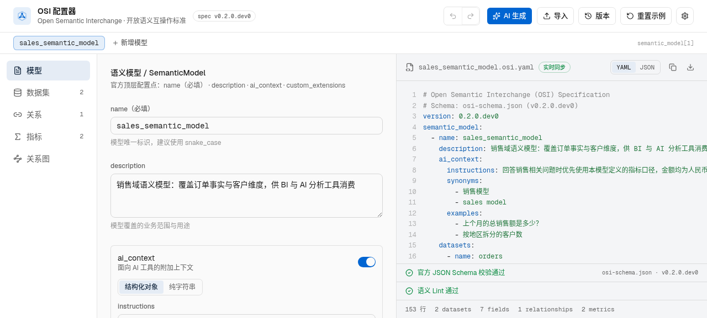
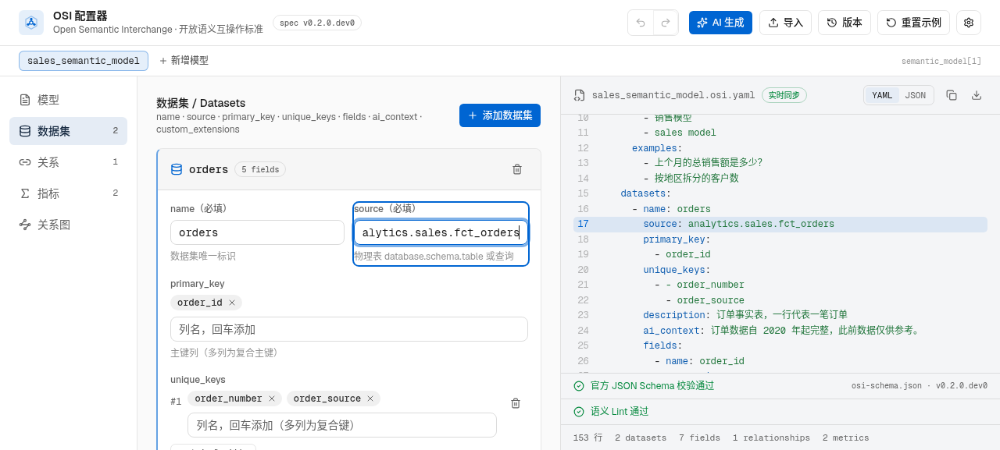
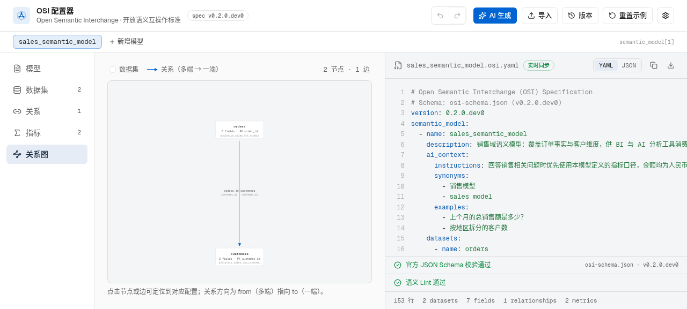
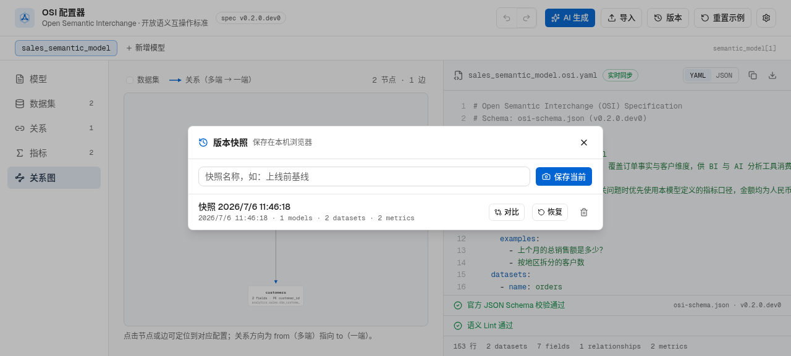
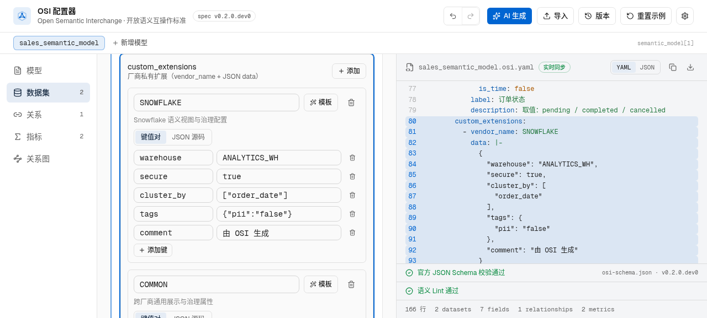
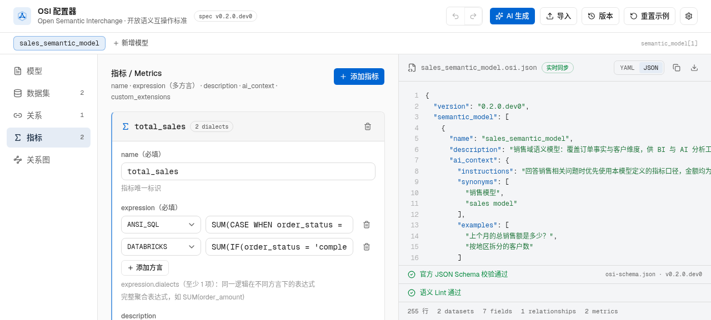

# OSI 可视化配置器

Open Semantic Interchange（OSI）标准的可视化配置器：左侧表单配置语义模型，右侧实时生成符合官方 JSON Schema（v0.2.0.dev0）的 YAML / JSON 规范文件。适用于为 BI、AI 分析工具定义统一的语义层（数据集、维度、指标、关系与 AI 上下文）。

> 详细文档见 [Wiki](docs/wiki/Home.md)：[快速上手](docs/wiki/快速上手.md) · [OSI 规范对齐](docs/wiki/OSI-规范对齐.md) · [AI 生成与局部调整](docs/wiki/AI-生成与局部调整.md) · [功能指南](docs/wiki/功能指南.md)



## 功能

### 1:1 覆盖官方 OSI 规范全部配置点

严格对齐官方 [open-semantic-interchange/OSI](https://github.com/open-semantic-interchange/OSI) 仓库的 `osi-schema.json`，不多不少：

| 配置对象 | 支持的配置点 |
| --- | --- |
| SemanticModel | name / description / ai_context / datasets / relationships / metrics / custom_extensions |
| Dataset | name / source / primary_key / unique_keys（多组复合键）/ description / ai_context / fields / custom_extensions |
| Field | name / expression（多方言 dialects）/ dimension 三态（非维度 · `{}` · is_time）/ label / description / ai_context / custom_extensions |
| Relationship | name / from / to / from_columns / to_columns（复合键）/ ai_context / custom_extensions |
| Metric | name / expression（多方言）/ description / ai_context / custom_extensions |
| AIContext | 官方 oneOf 两种形态：结构化对象（instructions + synonyms + examples）或纯字符串 |
| CustomExtension | vendor_name + JSON data，任意层级均可挂载 |

### AI 生成与局部调整

内置 AI 面板（支持自定义 OpenAI 兼容提供商）：

- **生成新模型**：用一段业务描述从零生成完整语义模型
- **调整当前模型**：AI 只输出补丁操作列表（`upsert_dataset` / `delete_field` / `upsert_metric` 等九种操作），本地逐条应用——未提及的节点零触碰，应用前展示变更摘要（`字段 +1 | 指标 -1`）与逐条警告


### 字段级双向高亮联动

点击或聚焦左侧任意输入项（如某个数据集的 `source`），右侧 YAML/JSON 中对应的行立即高亮并滚动定位；反过来点击右侧规范中的任意一行，自动切换到对应分区、展开折叠的卡片并精确高亮到具体输入框。



### 官方 JSON Schema 校验 + 语义级 Lint

- **Schema 校验**：内置 Ajv 按官方 `osi-schema.json`（draft 2020-12）实时校验，出错时列出 JSON 指针路径与中文错误说明，点击错误直接跳转到对应表单项
- **语义 Lint**：Schema 之上的业务级检查——实体重名、关系引用的数据集/列是否存在、自引用关系、snake_case 命名规范、描述与 ai_context 覆盖率、指标缺 ANSI_SQL 方言等十余条规则，按错误 / 警告 / 建议三级展示，点击问题联动定位

### 本体关系图

「关系图」分区以图形化视图展示数据集节点与关系边（from 多端 → to 一端，含列映射），点击节点或边联动右侧规范定位。



### 撤销重做 + 本机自动保存 + 版本快照

- **撤销重做**：Ctrl+Z / Ctrl+Shift+Z（连续输入自动合并为一步，上限 60 步）
- **自动保存**：编辑自动持久化到本机浏览器，刷新后完整恢复
- **版本快照**：命名保存任意版本，支持恢复（恢复本身可撤销）与实体级 diff 对比



### 厂商扩展配置（custom_extensions）

OSI 是开放标准，各厂商实现有差异——通过官方 `custom_extensions` 挂载厂商私有配置：

- 内置 COMMON / SNOWFLAKE / DBT / DATABRICKS / GOODDATA / SALESFORCE 六个厂商的常用配置键预设（带用途说明与示例值），也支持任意自定义厂商
- 识别到已知厂商时提供「模板」一键插入全部常用键，未用键以快捷芯片补加
- 键值对 / JSON 源码双模式编辑，数据始终按官方要求存为 JSON 字符串



### 多方言表达式与 YAML / JSON 双格式

指标与字段的 expression 支持按 SQL 方言（ANSI_SQL、SNOWFLAKE、DATABRICKS、TABLEAU、MDX、MAQL）分别定义表达式；右侧预览可在 YAML 与 JSON 间一键切换，带语法高亮和行号。



### 导入 / 导出

- **导入**：顶栏「导入」按钮，支持 `.yaml` / `.yml` / `.json` / `.osi` 规范文件，反向解析回表单继续编辑（与导出互为逆操作，round-trip 无损）；非法方言值自动归一到官方枚举
- **导出**：右侧预览的复制 / 下载按钮，输出 `<模型名>.osi.yaml` 或 `.osi.json`

## 桌面版下载（Windows / macOS / Linux）

到 [Releases](https://github.com/gatesenman/osi-configurator/releases) 页面下载对应平台安装包：

| 平台 | 文件 | 说明 |
| --- | --- | --- |
| Windows | `OSI.Configurator.Setup.x.x.x.exe` | NSIS 安装器 |
| macOS | `OSI.Configurator-x.x.x-universal.dmg` | Intel / Apple Silicon 通用 |
| Linux | `OSI.Configurator-x.x.x.AppImage` | 免安装，`chmod +x` 后直接运行 |

> 安装包未做代码签名：Windows 首次运行需在 SmartScreen 中点「仍要运行」；macOS 首次打开需右键 →「打开」（或在 系统设置 → 隐私与安全性 中允许）。

推送 `v*` 标签（如 `v0.2.0`）会由 GitHub Actions 自动在三平台云端矩阵构建并发布新 Release。

## 本地开发

环境要求（Windows / macOS / Linux 通用）：Node.js >= 20，pnpm 10（`npm install -g pnpm` 或 `corepack enable`）。

```bash
# 安装依赖
pnpm install

# 启动开发服务器（http://localhost:3000）
pnpm dev

# 构建 Web 版（静态导出，产物在 out/）
pnpm build

# 构建当前平台桌面安装包（产物在 dist/）
pnpm desktop:build
```

> macOS 安装包只能在 Mac 上构建，Windows 安装包建议在 Windows 上构建——三平台安装包由 GitHub Actions 云端矩阵统一构建。

## 跨平台说明

- 所有 npm scripts 仅使用 Next.js / Electron CLI，无 shell 特定语法，三平台直接可用
- `.gitattributes` 统一仓库内换行符为 LF，Windows 上 clone / commit 不会产生 CRLF 差异
- `package.json` 的 `engines` 与 `packageManager` 字段锁定 Node / pnpm 版本，配合 `corepack enable` 三平台行为一致

## 技术栈

- **框架**：Next.js 16（静态导出）+ React 19 + TypeScript
- **UI**：Tailwind CSS v4 + shadcn/ui
- **校验**：Ajv（JSON Schema draft 2020-12）+ 自研语义 Lint
- **解析**：yaml（导入 YAML 规范）
- **桌面**：Electron + electron-builder，GitHub Actions 三平台矩阵构建

## 目录结构

```
app/                    # Next.js 页面与全局样式（含 icon.svg 站点图标）
components/osi/         # 配置器组件
  configurator.tsx      #   主框架（分区导航、撤销重做、快照入口）
  *-panel.tsx           #   各分区表单面板
  spec-preview.tsx      #   规范预览（校验 + Lint 状态）
  graph-view.tsx        #   本体关系图
  snapshots-dialog.tsx  #   版本快照与对比
  ai-panel.tsx          #   AI 生成 / 局部调整
  shared-editors.tsx    #   共享编辑器（含厂商扩展编辑）
  logo.tsx              #   品牌标识
lib/
  osi-types.ts          # 编辑器内部模型类型
  osi-schema.json       # 官方 OSI JSON Schema（v0.2.0.dev0）
  osi-serialize.ts      # 模型 → 规范序列化（含字段级选择键）
  osi-import.ts         # 规范 → 模型反向解析（方言归一化）
  osi-validate.ts       # Ajv 官方 Schema 校验
  osi-lint.ts           # 语义级 Lint 规则引擎
  osi-history.ts        # 撤销重做 + 本机持久化
  osi-snapshots.ts      # 版本快照与实体级 diff
  osi-patch.ts          # AI 局部调整补丁操作
  osi-vendors.ts        # 厂商扩展预设库
  osi-ai.ts             # AI 提供商与提示词
  osi-defaults.ts       # 内置销售域示例模型
electron/               # Electron 主进程
.github/workflows/      # 三平台桌面构建工作流
docs/screenshots/       # README 截图
```

## 许可

本项目基于 OSI 开放规范构建，规范本身版权归 [Open Semantic Interchange](https://github.com/open-semantic-interchange) 项目所有。
