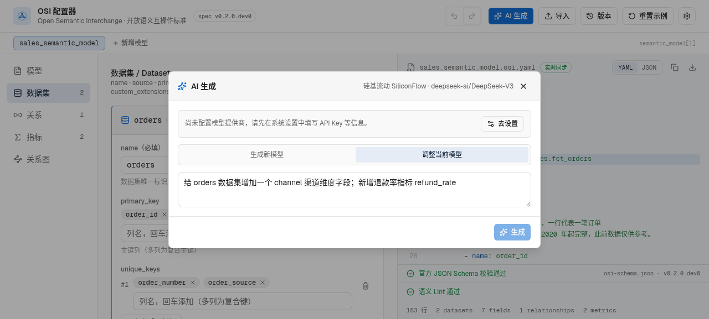

# AI 生成与局部调整

顶栏「AI 生成」打开 AI 面板，支持两种模式。

## 提供商配置

右上角设置 → 填写 API 地址、API Key 与模型名。任何 OpenAI 兼容接口均可（如 SiliconFlow、DeepSeek、通义、本地 Ollama 等）。配置仅保存在本机浏览器。

## 生成新模型

输入一段业务描述（如"电商销售域：订单、客户、退款，需要 GMV 和退款率指标"），AI 生成完整语义模型。生成结果先经官方 Schema 校验，通过后才可应用。

## 调整当前模型（补丁式）

调整模式下 AI **不重写整份 YAML**，只输出操作列表，本地逐条应用：

| 操作 | 说明 |
| --- | --- |
| `upsert_dataset` / `delete_dataset` | 新增/替换/删除数据集（删除会级联清理引用它的关系） |
| `upsert_field` / `delete_field` | 指定数据集内新增/替换/删除字段 |
| `upsert_metric` / `delete_metric` | 新增/替换/删除指标 |
| `upsert_relationship` / `delete_relationship` | 新增/替换/删除关系 |
| `set_model` | 修改模型级属性（只写要改的键） |

### 安全保证

- **未提及节点零触碰**：按 name 匹配，未涉及的实体保留原对象与内部 id，界面折叠状态不受影响
- **应用前试算**：展示变更摘要（如 `字段 +1 | 指标 -1`）与逐条警告（目标不存在、格式错误等），确认后才应用
- **视图不跳转**：局部调整应用后保持当前分区与浏览位置
- **可撤销**：应用后随时 Ctrl+Z 回退
